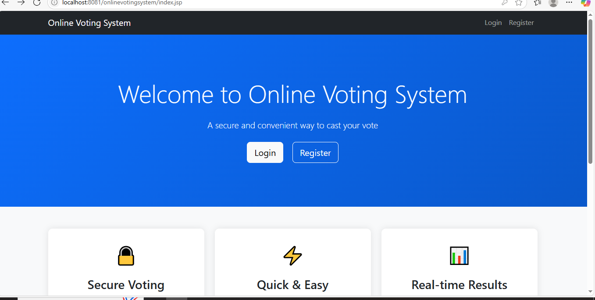
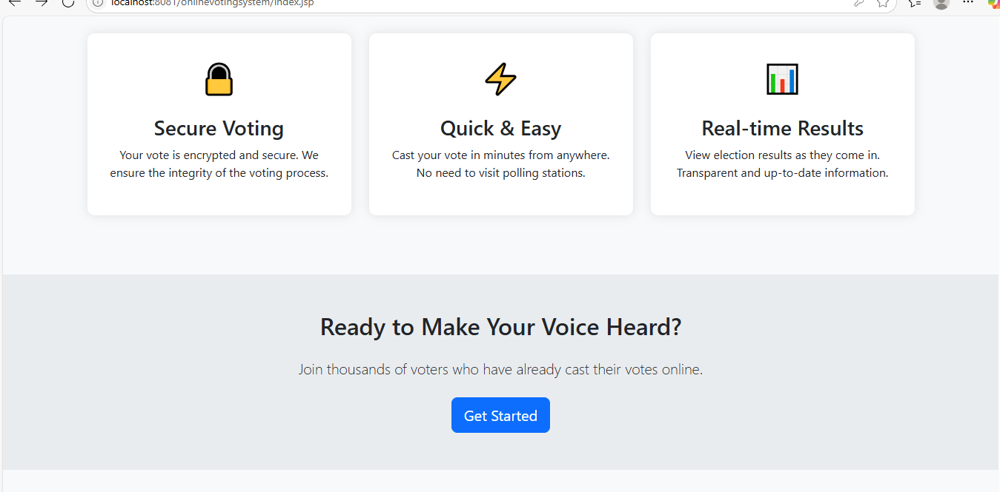
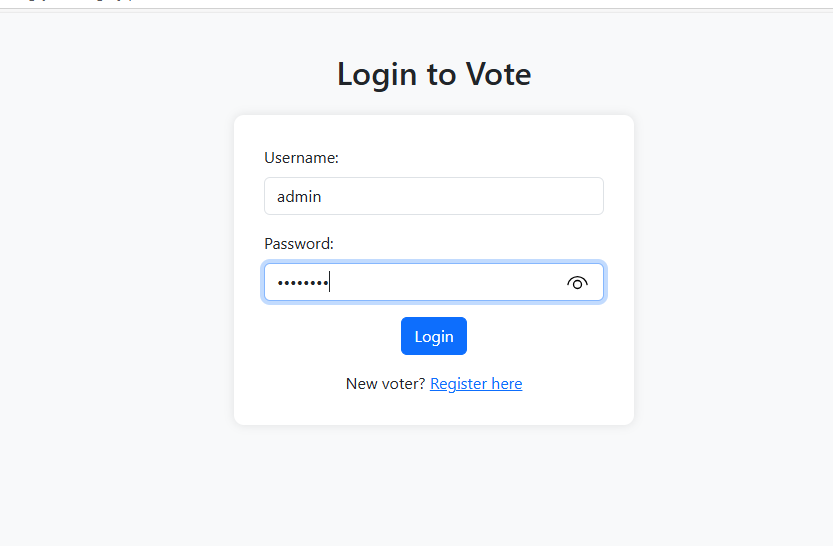
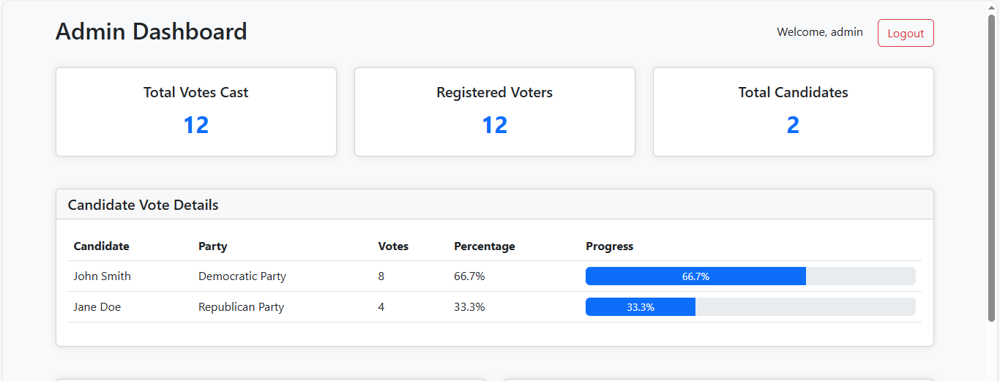
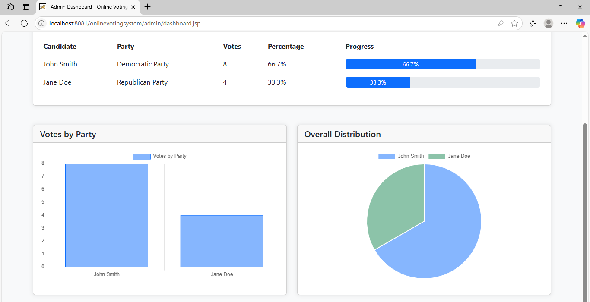
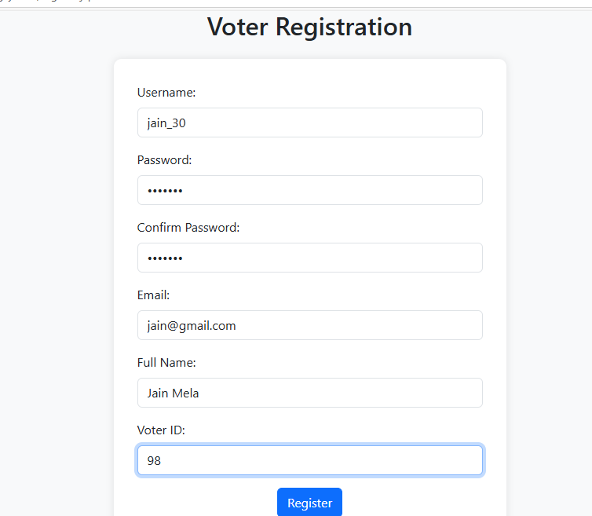
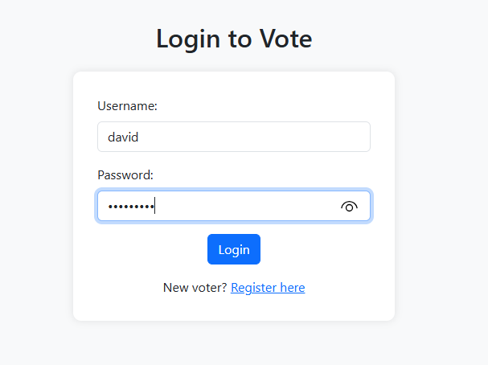
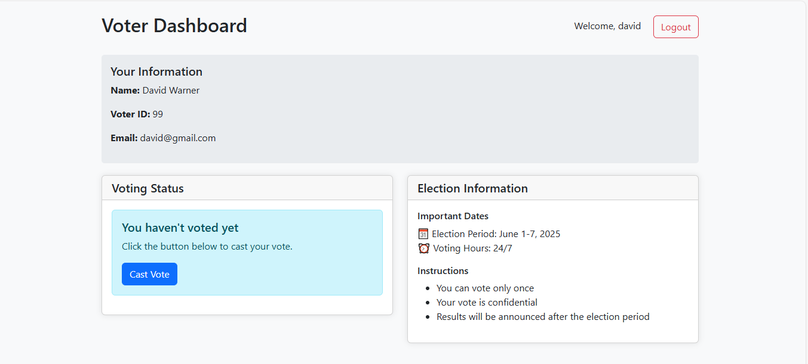
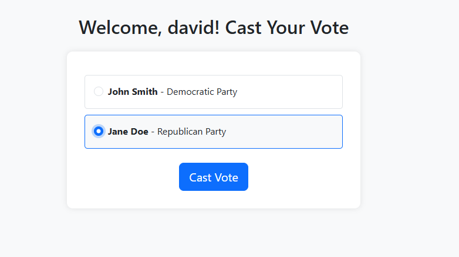
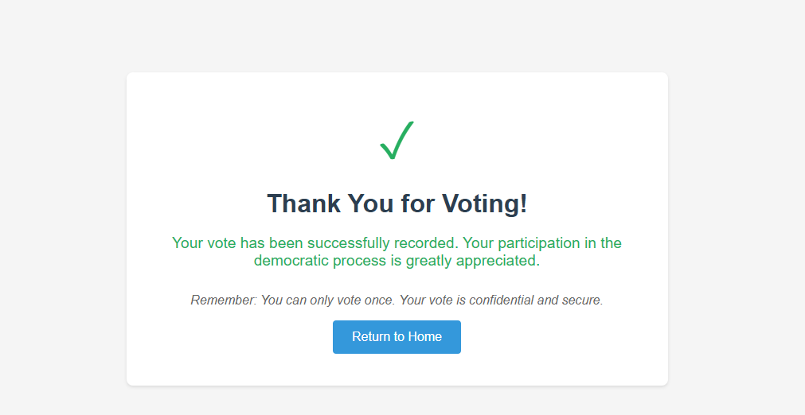

# Online Voting System

The Online Voting System is a comprehensive web application designed to facilitate secure and transparent electronic voting processes. This system implements modern security practices and provides a user-friendly interface for both voters and administrators.

### 🎯 Key Objectives
- Provide a secure platform for electronic voting
- Ensure transparency in the voting process
- Maintain accurate vote counting and results
- Offer real-time result monitoring
- Enable efficient voter and candidate management

## Features

- User Authentication (Voter & Admin)
- Secure Voting Process
- Real-time Results
- Admin Dashboard
- Candidate Management
- Voter Registration
- Database Management

## Technologies Used

- **Backend**: Java, Servlets
- **Frontend**: JSP, HTML, CSS, JavaScript
- **Database**: MySQL
- **Server**: Apache Tomcat 9.0
- **Build Tool**: Apache Ant
- **IDE**: Eclipse/VS Code

##  Database Setup
1. Install MySQL Server
2. Run the database setup script:
```bash
cd onlinevotingsystem
setup_database.bat
```
## Configure Environment Variables
Set the following environment variables:
- `JAVA_HOME`: Path to your JDK installation
- `CATALINA_HOME`: Path to your Tomcat installation

Build and Deploy
 ## Option 1: Using Scripts
 
    ## Compile the project
    compile.bat

    ## Create WAR file
    create_war.bat

     ## Deploy to Tomcat
    deploy.bat

     ## Start Tomcat server
    start_tomcat.bat

#### Option 2: Manual Deployment
1. Build the project using your IDE
2. Copy `onlinevotingsystem.war` to `[TOMCAT_HOME]/webapps/`
3. Start Tomcat server

### 5. Access the Application
- Open your web browser
- Navigate to: `http://localhost:8081/onlinevotingsystem/`


## Structure

    Online Voting System/
    ├── images/
    ├── onlinevotingsystem/
    │   ├── src/
    │   │   └── main/
    │   │       ├── java/
    │   │       │   └── com/
    │   │       │       └── voting/
    │   │       │           ├── servlet/    # Servlet controllers
    │   │       │           ├── util/       # Utility classes
    │   │       │           ├── dao/        # Data Access Objects
    │   │       │           └── model/      # Data models
    │   │       └── resources/
    │   ├── WebContent/
    │   │   ├── WEB-INF/
    │   │   ├── admin/          # Admin interface pages
    │   │   ├── voter/          # Voter interface pages
    │   │   ├── js/            # JavaScript files
    │   │   ├── css/           # Stylesheets
    │   │   ├── index.jsp      # Home page
    │   │   ├── login.jsp      # Login page
    │   │   ├── register.jsp   # Registration page
    │   │   ├── vote.jsp       # Voting page
    │   │   ├── results.jsp    # Results page
    │   │   └── thank-you.jsp  # Confirmation page
    │   ├── database/
    │   ├── build/
    │   ├── web/
    │   ├── onlinevotingsystem.war
    │   ├── build_and_deploy.bat
    │   ├── compile.bat
    │   ├── create_war.bat
    │   ├── deploy.bat
    │   ├── start_tomcat.bat
    │   ├── setup_database.bat
    │   ├── check_logs.bat
    │   └── verify_candidates.sql
    ├── .vscode/
    ├── temp_classes/
    ├── README.md
    ├── project_structure.txt
    ├── check_db.bat
    └── check_db.sql

## Setup Instructions

1.  **Database Setup:**
    - Create a MySQL (or other compatible SQL) database.
    - Run the following SQL scripts to create necessary tables:
    ```sql
    CREATE TABLE users (
        id INT PRIMARY KEY AUTO_INCREMENT,
        username VARCHAR(50) UNIQUE NOT NULL,
        password VARCHAR(255) NOT NULL
    );

    CREATE TABLE candidates (
        id INT PRIMARY KEY AUTO_INCREMENT,
        name VARCHAR(100) NOT NULL,
        party VARCHAR(100),
        position VARCHAR(100)
    );

    CREATE TABLE votes (
        id INT PRIMARY KEY AUTO_INCREMENT,
        user_id INT NOT NULL,
        candidate_id INT NOT NULL,
        vote_timestamp TIMESTAMP DEFAULT CURRENT_TIMESTAMP,
        FOREIGN KEY (user_id) REFERENCES users(id),
        FOREIGN KEY (candidate_id) REFERENCES candidates(id)
    );
    ```
    - Update the `DBUtil.java` file (or equivalent) with your database connection details (URL, username, password).
  
## 🔧 Configuration

## Database Configuration
- Edit `database/config.properties` to set your database credentials
- Default port: 3306
- Default database name: `voting_system`


## Server Configuration
- Default port: 8081
- To change port: Edit `[TOMCAT_HOME]/conf/server.xml`

## 🛠️ Available Scripts

- `build_and_deploy.bat`: Complete build and deployment
- `compile.bat`: Compile the project
- `create_war.bat`: Create WAR file
- `deploy.bat`: Deploy to Tomcat
- `start_tomcat.bat`: Start Tomcat server
- `setup_database.bat`: Setup database
- `check_logs.bat`: View application logs

##  Acknowledgments

- Apache Tomcat
- MySQL
- Java Community 
  
## ScreenShots

## UserInterface
        


## UserInterface2
      



## AdminLogin



## AdminDashboard
        
 

## Result Graph
       
!

## Registration
      


## Login



## Voter Dashboard
    


        
## Candidates



       
## Redirect to home



      
     
     

1.  Access the application through your web browser (e.g., `http://localhost:8080/onlinevotingsystem`).
2.  Register/Login as a user.
3.  Cast your vote for a candidate.
4.  View real-time vote results and statistics on the results page.
